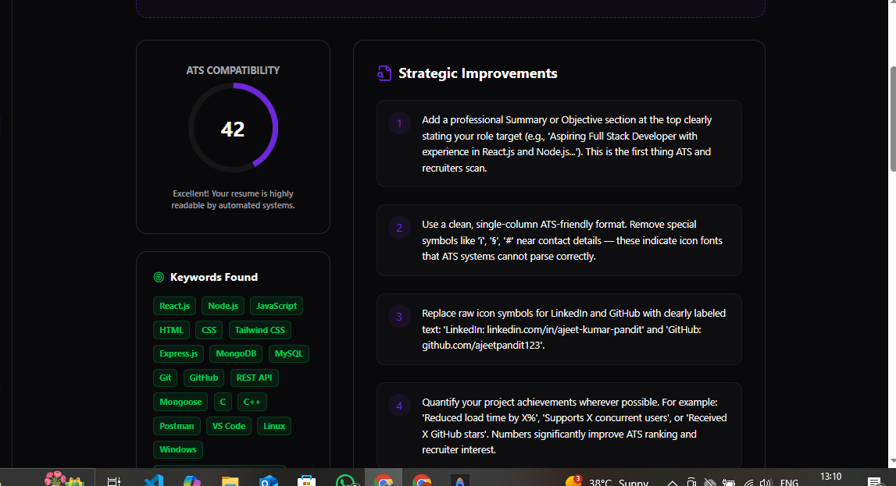

# 🚀 DevIntel AI - Modern Developer Mentorship Platform

DevIntel AI is a cutting-edge, AI-powered platform designed to accelerate developer growth. By analyzing GitHub repositories, resumes, and skill sets, DevIntel provides personalized learning paths, real-time code feedback, and professional career guidance.



## ✨ Key Features

- **🔍 GitHub Repository Analyzer**: Get instant, AI-driven feedback on your code quality, architecture, and best practices directly from your GitHub repos.
- **📄 ATS Resume Optimizer**: Upload your resume to receive an ATS compatibility score and actionable tips to stand out to recruiters.
- **🗺️ Dynamic Learning Roadmaps**: Personalized, AI-generated weekly plans tailored to your specific career goals and skill gaps.
- **💬 AI Mentor Chat**: A context-aware chat assistant that understands your projects and skills to provide precise guidance.
- **📊 Growth Dashboard**: Track your progress, monitor your skill evolution, and visualize your journey to becoming a senior developer.
- **💳 Premium Features**: Seamless integration with Razorpay for unlocking advanced AI analysis and unlimited mentor sessions.

## 🛠️ Tech Stack

| Component | Technology |
| :--- | :--- |
| **Frontend** | [Next.js 15](https://nextjs.org/) (App Router), TypeScript, Tailwind CSS |
| **Animations** | [Framer Motion](https://www.framer.com/motion/) |
| **Backend** | Next.js API Routes (Edge Runtime where applicable) |
| **Database** | [Supabase](https://supabase.com/) (PostgreSQL) |
| **Authentication** | Supabase Auth |
| **AI Engine** | [Google Gemini 2.5 Flash](https://aistudio.google.com/) |
| **Payments** | [Razorpay](https://razorpay.com/) |

## 🚀 Getting Started

### Prerequisites

- Node.js 18+ 
- npm or yarn
- A Supabase account
- A Google AI Studio (Gemini) API Key

### Installation

1. **Clone the repository**:
   ```bash
   git clone https://github.com/your-username/dev-monitor.git
   cd dev-monitor
   ```

2. **Install dependencies**:
   ```bash
   npm install
   ```

3. **Configure Environment Variables**:
   Create a `.env` file in the root directory (refer to `.env.example`):
   ```env
   NEXT_PUBLIC_SUPABASE_URL=your_supabase_url
   NEXT_PUBLIC_SUPABASE_ANON_KEY=your_supabase_anon_key
   SUPABASE_SERVICE_ROLE_KEY=your_service_role_key
   GOOGLE_API_KEY=your_google_api_key
   GEMINI_MODEL=gemini-2.5-flash
   RAZORPAY_KEY_ID=your_razorpay_key
   RAZORPAY_KEY_SECRET=your_razorpay_secret
   GITHUB_ACCESS_TOKEN=your_github_token
   ```

4. **Database Setup**:
   Initialize your Supabase database using the schema found in `/supabase/schema.sql`.

5. **Start Developing**:
   ```bash
   npm run dev
   ```

The application will be available at [http://localhost:3000](http://localhost:3000).

## 📁 Project Structure

```text
├── src/
│   ├── app/            # Next.js App Router (Pages & API)
│   ├── components/     # Reusable UI components
│   ├── hooks/          # Custom React hooks
│   ├── lib/            # Utility functions and shared logic
│   ├── server/         # Backend services and AI logic
│   └── types/          # TypeScript definitions
├── public/             # Static assets
├── supabase/           # Database migrations and seed data
└── scratch/            # Temporary scripts and tools
```

## 📜 License

This project is licensed under the MIT License - see the [LICENSE](LICENSE) file for details.

---

Built with ❤️ by the DevIntel Team.
